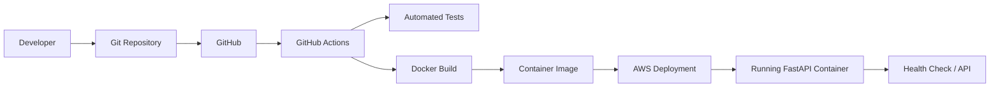
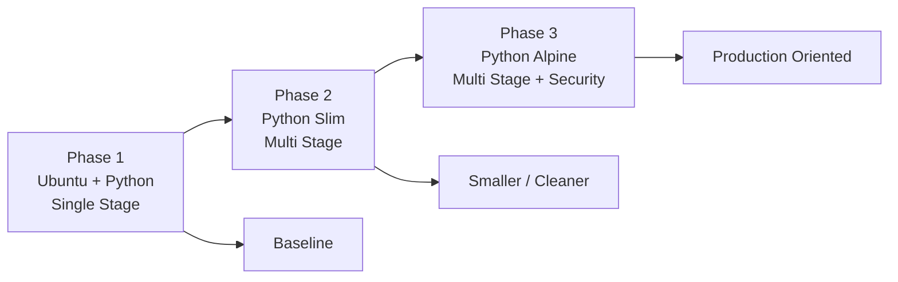
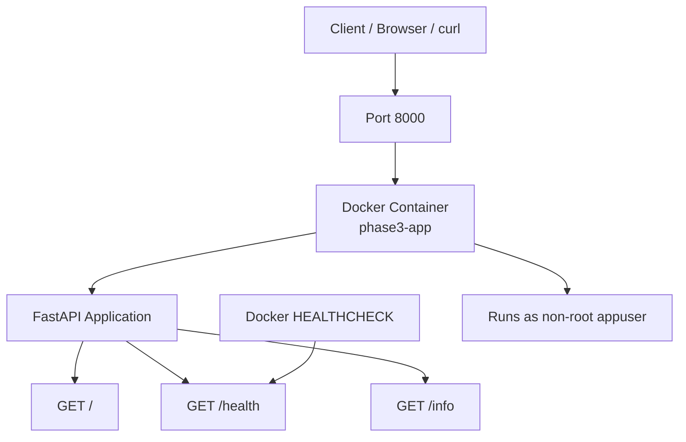
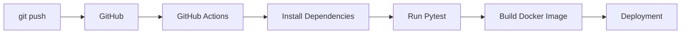
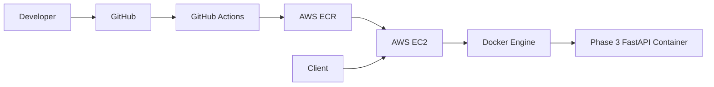

# 🐳 Docker Mastery Project

> A hands-on Docker and DevOps portfolio project that demonstrates containerization, image optimization, testing, CI/CD fundamentals, security practices, and a path toward AWS deployment.


---

## 📌 Project Overview

The **Docker Mastery Project** is a progressive DevOps learning and portfolio project built around the same small FastAPI application and evolved through three Docker maturity levels.

The objective is not simply to run an application in Docker, but to demonstrate how a containerized application can progressively become:

- easier to build
- smaller and more efficient
- reproducible
- testable
- secure
- observable
- CI/CD ready
- deployable to cloud infrastructure

### Project progression

| Phase | Focus | Key Docker Concepts |
|---|---|---|
| 🟢 Phase 1 | Beginner | Basic Dockerfile, image build, container execution |
| 🟡 Phase 2 | Intermediate | Multi-stage builds, dependency isolation, automated testing |
| 🔴 Phase 3 | Advanced | Alpine image, non-root user, health checks, production-oriented container |

The same application is intentionally used across all phases so the improvement in the Docker implementation can be clearly compared.

---

## 🎯 Project Objectives

This project demonstrates practical knowledge of:

- Docker fundamentals
- Dockerfiles
- Docker image creation
- Docker containers
- Port mapping
- Docker image optimization
- Multi-stage Docker builds
- `.dockerignore`
- Python dependency management
- FastAPI
- Pytest
- Container health checks
- Non-root containers
- Git and GitHub
- GitHub Actions
- CI/CD concepts
- AWS deployment preparation
- DevOps project structure

---

# 🏗️ Architecture

## High-Level Project Flow



## Docker Maturity Progression



## Phase 3 Runtime Architecture



---

# 📁 Repository Structure

```text
docker-mastery-project/
│
├── phase1-beginner/
│   ├── app/
│   │   └── main.py
│   ├── Dockerfile
│   ├── .dockerignore
│   ├── requirements.txt
│   ├── requirements-dev.txt
│   └── test_main.py
│
├── phase2-intermediate/
│   ├── app/
│   │   └── main.py
│   ├── Dockerfile
│   ├── .dockerignore
│   ├── requirements.txt
│   ├── requirements-dev.txt
│   ├── test_main.py
│   └── .github/
│       └── workflows/
│           └── ci-cd.yml
│
├── phase3-advanced/
│   ├── app/
│   │   └── main.py
│   ├── Dockerfile
│   ├── .dockerignore
│   ├── requirements.txt
│   ├── requirements-dev.txt
│   ├── test_main.py
│   └── .github/
│       └── workflows/
│
├── .gitignore
└── README.md
```

---

# 🧰 Technology Stack

| Technology | Purpose |
|---|---|
| Python 3.12 | Application runtime |
| FastAPI | REST API framework |
| Uvicorn | ASGI application server |
| Pytest | Automated testing |
| Docker | Application containerization |
| Docker Compose | Optional local orchestration |
| Git | Version control |
| GitHub | Source-code hosting |
| GitHub Actions | CI/CD automation |
| AWS EC2 | Planned cloud deployment |
| AWS ECR | Optional container image registry |

---

# 🚀 Getting Started

## 1. Prerequisites

Install the following tools:

- Git
- Docker Desktop
- WSL2 / Ubuntu on Windows
- Python 3.12+
- GitHub account
- AWS account for the cloud deployment phase

Verify the installation:

```bash
git --version
docker --version
python3 --version
```

Verify Docker:

```bash
docker run hello-world
```

---

# 🟢 Phase 1 — Beginner

## Objective

Build and run the FastAPI application using a basic single-stage Dockerfile.

### Main concepts

- `FROM`
- `WORKDIR`
- `COPY`
- `RUN`
- `EXPOSE`
- `CMD`
- Docker image creation
- Container execution
- Port mapping

## Navigate to Phase 1

```bash
cd ~/docker-mastery-project/phase1-beginner
```

## Install dependencies locally

```bash
python3 -m venv venv
source venv/bin/activate
pip install -r requirements.txt
pip install -r requirements-dev.txt
```

## Run tests

```bash
pytest
```

## Build the Docker image

```bash
docker build -t docker-mastery:phase1 .
```

## Run the container

```bash
docker run -d \
  --name phase1-app \
  -p 8000:8000 \
  docker-mastery:phase1
```

## Verify

```bash
docker ps
```

Test the API:

```bash
curl http://localhost:8000/
curl http://localhost:8000/health
curl http://localhost:8000/info
```

## Stop and remove the container

```bash
docker stop phase1-app
docker rm phase1-app
```

---

# 🟡 Phase 2 — Intermediate

## Objective

Improve the Phase 1 implementation using a multi-stage Docker build and automated testing.

### Improvements

- Python slim base image
- Multi-stage Docker build
- Separate build/runtime stages
- Smaller runtime image
- Cleaner dependency installation
- Automated pytest validation
- GitHub Actions CI/CD workflow

## Navigate to Phase 2

```bash
cd ~/docker-mastery-project/phase2-intermediate
```

## Create / activate virtual environment

```bash
python3 -m venv venv
source venv/bin/activate
```

## Install dependencies

```bash
pip install -r requirements.txt
pip install -r requirements-dev.txt
```

## Run tests

```bash
pytest
```

Expected result:

```text
3 passed
```

## Build the image

```bash
docker build -t docker-mastery:phase2 .
```

## Run the container

```bash
docker run -d \
  --name phase2-app \
  -p 8000:8000 \
  docker-mastery:phase2
```

## Test the application

```bash
curl http://localhost:8000/
curl http://localhost:8000/health
curl http://localhost:8000/info
```

## Inspect the image

```bash
docker images
```

You can also inspect the exact image size:

```bash
docker image inspect docker-mastery:phase2 \
  --format='{{.Size}}'
```

---

# 🔴 Phase 3 — Advanced

## Objective

Create a more production-oriented container by combining:

- Alpine Linux
- Multi-stage builds
- Non-root execution
- Docker health checks
- Runtime-only application files
- Reduced image footprint

## Navigate to Phase 3

```bash
cd ~/docker-mastery-project/phase3-advanced
```

## Run local tests

```bash
python3 -m venv venv
source venv/bin/activate

pip install -r requirements.txt
pip install -r requirements-dev.txt

pytest
```

## Build

```bash
docker build -t docker-mastery:phase3 .
```

## Run

```bash
docker run -d \
  --name phase3-app \
  -p 8000:8000 \
  docker-mastery:phase3
```

## Verify container status

```bash
docker ps
```

The container should eventually show:

```text
(healthy)
```

## Check the health status directly

```bash
docker inspect phase3-app \
  --format='{{.State.Health.Status}}'
```

Expected:

```text
healthy
```

## Test the API

```bash
curl http://localhost:8000/
curl http://localhost:8000/health
curl http://localhost:8000/info
```

## Verify non-root execution

```bash
docker exec phase3-app whoami
```

Expected:

```text
appuser
```

---

# 🔍 API Endpoints

| Method | Endpoint | Purpose |
|---|---|---|
| GET | `/` | Application status |
| GET | `/health` | Health check |
| GET | `/info` | Application metadata |

### Root endpoint

```bash
curl http://localhost:8000/
```

Example response:

```json
{
  "message": "Welcome to the Docker Mastery Demo API",
  "phase": "advanced",
  "status": "running"
}
```

### Health endpoint

```bash
curl http://localhost:8000/health
```

Example:

```json
{
  "status": "healthy",
  "timestamp": "..."
}
```

### Info endpoint

```bash
curl http://localhost:8000/info
```

Example:

```json
{
  "app": "docker-mastery-demo",
  "version": "1.0.0",
  "phase": "advanced"
}
```

---

# 🧪 Testing Strategy

Each phase contains automated API tests using Pytest.

Example:

```bash
pytest
```

The test suite validates:

- Root endpoint availability
- Health endpoint availability
- Application metadata
- HTTP status codes
- Expected JSON response fields

The project uses:

```text
FastAPI TestClient
Pytest
```

---

# 🐳 Dockerfile Evolution

## Phase 1

```text
Ubuntu
  ↓
Install Python
  ↓
Install dependencies
  ↓
Copy application
  ↓
Run application
```

Simple and beginner-friendly, but includes more operating-system/runtime components than necessary.

## Phase 2

```text
Python Slim
     ↓
 Builder Stage
     ↓
Install dependencies
     ↓
 Runtime Stage
     ↓
Copy required runtime files
     ↓
Run FastAPI
```

This separates dependency installation from the final runtime image.

## Phase 3

```text
Python Alpine
     ↓
 Builder Stage
     ↓
Build dependencies
     ↓
 Runtime Stage
     ↓
Non-root appuser
     ↓
Healthcheck
     ↓
FastAPI
```

This provides a more security-conscious and production-oriented container design.

---

# 📊 Image Optimization

The project compares Docker image sizes across the three implementation stages.

| Phase | Docker Strategy | Approx. Docker CLI Size* |
|---|---|---:|
| Phase 1 | Ubuntu + single stage | ~266 MB |
| Phase 2 | Python Slim + multi-stage | ~272 MB |
| Phase 3 | Python Alpine + multi-stage | ~168 MB |

\*Image size displayed by Docker can differ depending on whether you are looking at virtual size, local disk usage, layers, and shared layers. Use `docker image inspect` when you need the exact image byte size.

The main objective is not to optimize for image size alone. Phase 3 also adds:

- non-root execution
- health checks
- reduced runtime contents
- multi-stage build
- production-oriented runtime configuration

---

# 🔐 Container Security

Phase 3 introduces basic container hardening.

### Non-root user

The application does not run as Docker's default root user.

```dockerfile
USER appuser
```

Verify:

```bash
docker exec phase3-app whoami
```

Expected:

```text
appuser
```

### Runtime image separation

Build tools are kept in the builder stage instead of being intentionally included in the final runtime stage.

### `.dockerignore`

Development-only files such as:

```text
venv/
.git/
.github/
.pytest_cache/
test_main.py
requirements-dev.txt
.env
```

are excluded from the Docker build context where appropriate.

---

# ❤️ Health Checks

Phase 3 includes a Docker `HEALTHCHECK`.

Conceptually:

```text
Docker
  │
  ├── Starts container
  │
  ├── Runs application
  │
  └── Calls /health
          │
          ├── HTTP success → healthy
          └── Failure → unhealthy
```

Check the status:

```bash
docker inspect phase3-app \
  --format='{{.State.Health.Status}}'
```

---

# 🔄 CI/CD

The project is structured to support GitHub Actions.

The intended pipeline is:



Typical CI checks include:

```bash
pip install -r requirements.txt
pip install -r requirements-dev.txt
pytest
```

Docker validation can then build each phase:

```bash
docker build -t docker-mastery:phase1 ./phase1-beginner
docker build -t docker-mastery:phase2 ./phase2-intermediate
docker build -t docker-mastery:phase3 ./phase3-advanced
```

---

# ☁️ AWS Deployment Roadmap

The final stage of this project is intended to demonstrate deployment to AWS.

## Planned architecture



### Planned AWS components

- AWS EC2
- AWS ECR
- Security Groups
- IAM
- Docker
- GitHub Actions

### Deployment flow

```text
Developer
    ↓
GitHub
    ↓
GitHub Actions
    ↓
Run tests
    ↓
Build Docker image
    ↓
Push image to Amazon ECR
    ↓
EC2 pulls image
    ↓
Docker runs container
    ↓
Application available through EC2
```

Detailed AWS instructions can be maintained separately in:

```text
phase3-advanced/EC2-SETUP.md
```

---

# 🖼️ Project Presentation Images

For a professional portfolio repository, keep screenshots/diagrams in:

```text
docs/
└── images/
    ├── architecture-overview.png
    ├── phase-comparison.png
    ├── docker-images.png
    ├── phase3-container-healthy.png
    ├── api-endpoints.png
    ├── non-root-container.png
    ├── github-actions.png
    └── aws-deployment.png
```

Recommended screenshots to capture:

### 1. Docker image comparison

Show:

```bash
docker images
```

This demonstrates the progression between the phases.

### 2. Running containers

Show:

```bash
docker ps
```

### 3. Phase 3 health check

Show:

```bash
docker inspect phase3-app \
  --format='{{.State.Health.Status}}'
```

with:

```text
healthy
```

### 4. Non-root execution

Show:

```bash
docker exec phase3-app whoami
```

with:

```text
appuser
```

### 5. API validation

Show:

```bash
curl http://localhost:8000/
curl http://localhost:8000/health
curl http://localhost:8000/info
```

### 6. Automated tests

Show:

```bash
pytest
```

with the successful test result.

### 7. GitHub Actions

Capture the workflow showing:

```text
Build → Test → Docker Build
```

### 8. AWS deployment

After deployment, capture:

- EC2 instance
- ECR repository
- running Docker container
- application response in browser/curl

---

# 🧹 Useful Docker Commands

## List containers

```bash
docker ps
```

All containers:

```bash
docker ps -a
```

## Stop a container

```bash
docker stop <container-name>
```

## Start an existing container

```bash
docker start <container-name>
```

## Remove a container

```bash
docker rm <container-name>
```

## View logs

```bash
docker logs <container-name>
```

Follow logs:

```bash
docker logs -f <container-name>
```

## List images

```bash
docker images
```

## Remove an image

```bash
docker rmi <image-name>
```

## Inspect an image

```bash
docker image inspect <image-name>
```

## Clean unused resources

Use carefully:

```bash
docker system prune
```

---

# 🛠️ Troubleshooting

## Port 8000 already in use

Check:

```bash
docker ps
```

Stop the container using port 8000:

```bash
docker stop <container-name>
```

Alternatively use another host port:

```bash
docker run -d \
  --name phase3-app \
  -p 8001:8000 \
  docker-mastery:phase3
```

Then access:

```bash
curl http://localhost:8001/
```

## Container exits immediately

Check:

```bash
docker ps -a
```

Then:

```bash
docker logs phase3-app
```

## Check image

```bash
docker images
```

## Rebuild without using the build cache

```bash
docker build --no-cache -t docker-mastery:phase3 .
```

---

# 📈 Learning Outcomes

By completing this project, the following progression is demonstrated:

```text
Docker Fundamentals
        ↓
Dockerfile
        ↓
Container Networking
        ↓
Image Optimization
        ↓
Multi-stage Builds
        ↓
Automated Testing
        ↓
CI/CD
        ↓
Container Security
        ↓
Health Monitoring
        ↓
AWS Deployment
```

---

# 🏆 Portfolio Highlights

This project demonstrates practical DevOps capabilities rather than only theoretical knowledge.

### Docker

- Containerized a FastAPI application
- Created Dockerfiles from scratch
- Used different Linux/Python base images
- Implemented multi-stage builds
- Reduced unnecessary runtime dependencies
- Used `.dockerignore`
- Configured port exposure

### Python / API

- Built a FastAPI service
- Implemented health and information endpoints
- Used Uvicorn as the ASGI server
- Added automated API tests

### Testing

- Pytest-based automated testing
- API endpoint validation
- Repeatable test execution

### Security

- Non-root application execution
- Reduced runtime image contents
- Health-check implementation
- Separation of build and runtime environments

### DevOps

- Git version control
- GitHub repository management
- GitHub Actions
- CI/CD pipeline design
- AWS deployment roadmap

---

# 📚 Key Commands Cheat Sheet

```bash
# Project
cd ~/docker-mastery-project

# Test
pytest

# Build
docker build -t docker-mastery:phase3 ./phase3-advanced

# Run
docker run -d --name phase3-app -p 8000:8000 docker-mastery:phase3

# Status
docker ps

# Logs
docker logs phase3-app

# Health
docker inspect phase3-app --format='{{.State.Health.Status}}'

# User
docker exec phase3-app whoami

# API
curl http://localhost:8000/
curl http://localhost:8000/health
curl http://localhost:8000/info

# Stop
docker stop phase3-app

# Remove
docker rm phase3-app
```

---

# 🔮 Future Improvements

Potential future enhancements include:

- Docker Compose
- Nginx reverse proxy
- HTTPS/TLS
- AWS ECR integration
- EC2 automated deployment
- GitHub Actions deployment
- Infrastructure as Code with Terraform
- AWS CloudWatch monitoring
- Container vulnerability scanning
- Trivy image scanning
- Docker image tagging strategy
- Environment-specific configurations
- Secrets management
- Kubernetes deployment

---

# 👨‍💻 Author

**Srinivas Polamuri**

This repository is part of a hands-on DevOps learning and portfolio journey focused on Docker, CI/CD, cloud deployment, and production-oriented engineering practices.

---

# ⭐ If You Find This Project Useful

If this project helps you understand Docker and DevOps concepts, feel free to:

- ⭐ Star the repository
- 🍴 Fork the repository
- 💬 Open an issue
- 🔧 Suggest improvements

---

## 📄 License

This project is intended for educational and portfolio purposes. Add an appropriate open-source license to the repository if you intend to distribute or reuse the project publicly.
