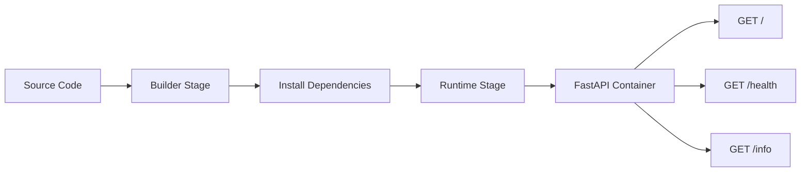
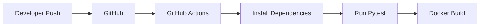

# 🐳 Phase 2 — Intermediate: Multi-Stage Docker Build

> An intermediate Docker implementation that improves the Phase 1 container using Python Slim, multi-stage builds, dependency separation, automated testing, and CI/CD foundations.

## 📌 Overview

Phase 2 takes the same FastAPI application from Phase 1 and introduces a more efficient Docker build strategy.

The major change is the separation between:

```text
Builder Stage
    ↓
Install application dependencies
    ↓
Runtime Stage
    ↓
Copy only required runtime artifacts
    ↓
Start FastAPI
```

This demonstrates an important Docker best practice: **build-time tooling does not need to remain in the final runtime image.**

---

# 🎯 Learning Objectives

By completing Phase 2, you should understand:

- Multi-stage Docker builds
- Builder vs runtime stages
- Python Slim base images
- Dependency isolation
- Docker layer considerations
- `.dockerignore`
- Automated API testing
- GitHub Actions fundamentals
- Comparing Docker images
- Container lifecycle management

---

# 🏗️ Architecture



## CI/CD Flow



---

# 📁 Project Structure

```text
phase2-intermediate/
│
├── app/
│   └── main.py
│
├── .github/
│   └── workflows/
│       └── ci-cd.yml
│
├── Dockerfile
├── .dockerignore
├── requirements.txt
├── requirements-dev.txt
├── test_main.py
└── README.md
```

| File | Purpose |
|---|---|
| `app/main.py` | FastAPI application |
| `Dockerfile` | Multi-stage image definition |
| `.dockerignore` | Reduces unnecessary build context |
| `requirements.txt` | Runtime dependencies |
| `requirements-dev.txt` | Development/testing dependencies |
| `test_main.py` | Automated API tests |
| `.github/workflows/ci-cd.yml` | CI/CD workflow |
| `README.md` | Phase documentation |

---

# 🧰 Technology Stack

- Python 3.12
- FastAPI `0.111.0`
- Uvicorn `0.30.1`
- Pytest
- Docker
- Python Slim
- GitHub Actions
- Git/GitHub

---

# 📋 Prerequisites

Check:

```bash
python3 --version
docker --version
git --version
```

Verify Docker:

```bash
docker run hello-world
```

---

# 1️⃣ Set Up the Development Environment

Navigate to Phase 2:

```bash
cd ~/docker-mastery-project/phase2-intermediate
```

Create the virtual environment:

```bash
python3 -m venv venv
```

Activate:

```bash
source venv/bin/activate
```

Install runtime dependencies:

```bash
pip install -r requirements.txt
```

Install development dependencies:

```bash
pip install -r requirements-dev.txt
```

---

# 2️⃣ Run Tests

```bash
pytest
```

The test suite validates:

```text
GET /
GET /health
GET /info
```

Expected:

```text
3 passed
```

---

# 3️⃣ Multi-Stage Dockerfile

The Phase 2 Dockerfile uses:

```dockerfile
FROM python:3.12-slim AS builder

WORKDIR /app

COPY requirements.txt .

RUN pip install --no-cache-dir --user -r requirements.txt

FROM python:3.12-slim

WORKDIR /app

COPY --from=builder /root/.local /root/.local

COPY app/ ./app

ENV PATH=/root/.local/bin:$PATH \
    PYTHONUNBUFFERED=1

EXPOSE 8000

CMD ["uvicorn", "app.main:app", "--host", "0.0.0.0", "--port", "8000"]
```

---

# 4️⃣ Understand the Multi-Stage Build

## Stage 1 — Builder

```dockerfile
FROM python:3.12-slim AS builder
```

The builder stage is responsible for installing the application dependencies.

```dockerfile
COPY requirements.txt .
RUN pip install --no-cache-dir --user -r requirements.txt
```

## Stage 2 — Runtime

```dockerfile
FROM python:3.12-slim
```

A fresh runtime image is created.

Only the required installed dependencies and application code are copied into the final image.

```dockerfile
COPY --from=builder /root/.local /root/.local
COPY app/ ./app
```

This prevents the complete builder environment from automatically becoming part of the runtime image.

---

# 5️⃣ Build the Image

From the Phase 2 directory:

```bash
docker build -t docker-mastery:phase2 .
```

Verify:

```bash
docker images
```

Inspect the image:

```bash
docker image inspect docker-mastery:phase2
```

View layers:

```bash
docker history docker-mastery:phase2
```

---

# 6️⃣ Optional Optimized Build

If an optimized Phase 2 Dockerfile/tag is being maintained separately, use its dedicated tag rather than replacing the baseline image.

Example:

```bash
docker build -t docker-mastery:phase2-optimized .
```

This allows comparison between the baseline and optimized implementation.

---

# 7️⃣ Run the Container

```bash
docker run -d \
  --name phase2-app \
  -p 8000:8000 \
  docker-mastery:phase2
```

Verify:

```bash
docker ps
```

View logs:

```bash
docker logs phase2-app
```

---

# 8️⃣ Test the API

```bash
curl http://localhost:8000/
```

```bash
curl http://localhost:8000/health
```

```bash
curl http://localhost:8000/info
```

The same API contract is retained from Phase 1, making the Docker improvements easier to compare.

---

# 9️⃣ Container Lifecycle

Stop:

```bash
docker stop phase2-app
```

Start:

```bash
docker start phase2-app
```

If the image was rebuilt and you need a fresh container:

```bash
docker stop phase2-app
docker rm phase2-app
```

Then:

```bash
docker run -d \
  --name phase2-app \
  -p 8000:8000 \
  docker-mastery:phase2
```

---

# 🔄 GitHub Actions

The `.github/workflows/ci-cd.yml` file provides the foundation for automated validation.

A typical workflow performs:

```text
Git Push
   ↓
GitHub Actions
   ↓
Set up Python
   ↓
Install dependencies
   ↓
Run pytest
   ↓
Build Docker image
```

This moves testing from a purely manual process toward repeatable CI.

---

# 🧪 Testing Strategy

Tests are intentionally small but meaningful.

They verify:

| Test | Validation |
|---|---|
| `test_root` | Root endpoint returns HTTP 200 and running status |
| `test_health` | Health endpoint returns HTTP 200 and healthy status |
| `test_info` | Application metadata is returned correctly |

Run:

```bash
pytest
```

---

# 📊 Phase 1 vs Phase 2

| Capability | Phase 1 | Phase 2 |
|---|---|---|
| Base | Ubuntu 22.04 | Python Slim |
| Build | Single-stage | Multi-stage |
| Dependency isolation | Basic | Improved |
| Runtime separation | No | Yes |
| Automated tests | Local | Local + CI foundation |
| `.dockerignore` | Yes | Yes |
| Main objective | Fundamentals | Optimization + workflow |

---

# 🧠 Key DevOps Concepts Demonstrated

### 1. Multi-stage builds

Build dependencies and runtime dependencies have different purposes.

### 2. Smaller base image

`python:3.12-slim` removes much of the unnecessary content found in a full Ubuntu environment.

### 3. Reproducible dependencies

Pinned runtime dependencies:

```text
fastapi==0.111.0
uvicorn[standard]==0.30.1
```

make the environment more predictable.

### 4. Automated testing

Pytest provides repeatable API validation.

### 5. CI/CD foundation

GitHub Actions can automatically run tests whenever code changes are pushed.

---

# 🖼️ Recommended Presentation Images

Create:

```text
images/
├── phase2-dockerfile.png
├── phase2-build.png
├── phase2-image-size.png
├── phase2-container.png
├── phase2-api-test.png
├── phase2-pytest.png
└── phase2-github-actions.png
```

Capture:

```bash
docker images
```

```bash
docker ps
```

```bash
docker history docker-mastery:phase2
```

```bash
pytest
```

And the GitHub Actions workflow page.

---

# ⚠️ Limitations

Phase 2 improves the architecture significantly, but it is not yet the final production-oriented design.

Remaining improvements include:

- Explicit non-root runtime user
- Docker health check
- Further runtime image reduction
- Container hardening
- Cloud deployment

These are addressed in Phase 3.

---

# 🚀 Next Step

Continue to:

**[Phase 3 — Advanced](../phase3-advanced/README.md)**

Phase 3 introduces Alpine, non-root execution, Docker health checks, and a more production-oriented runtime container.
