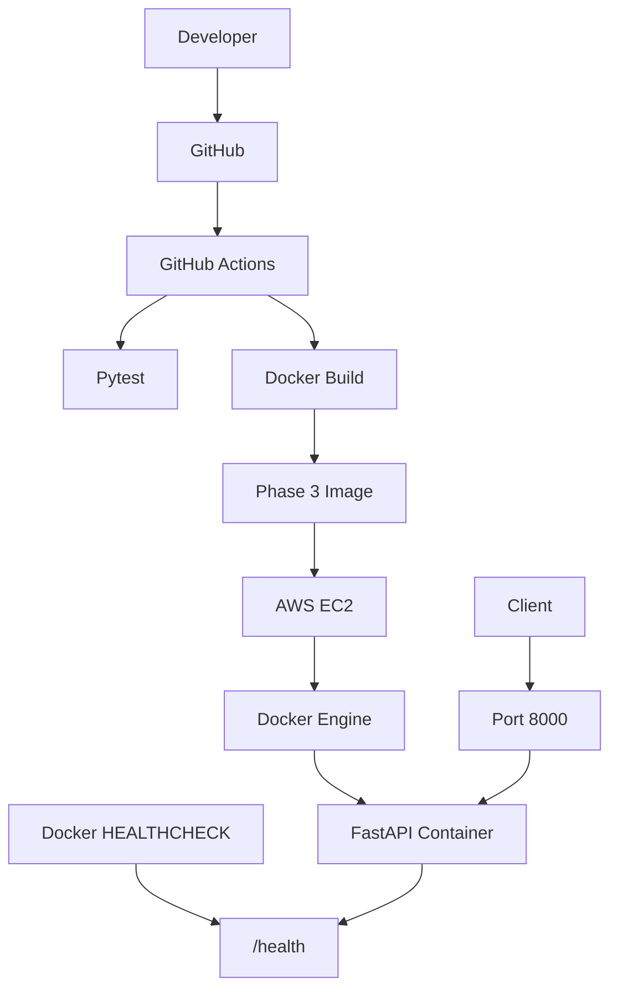
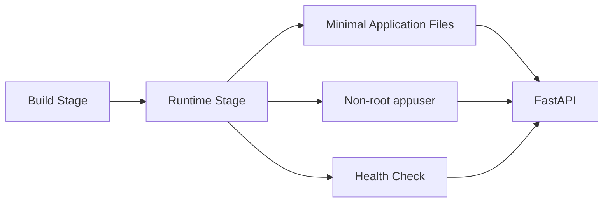
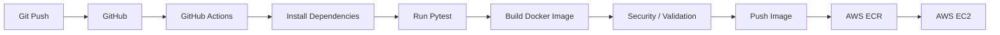
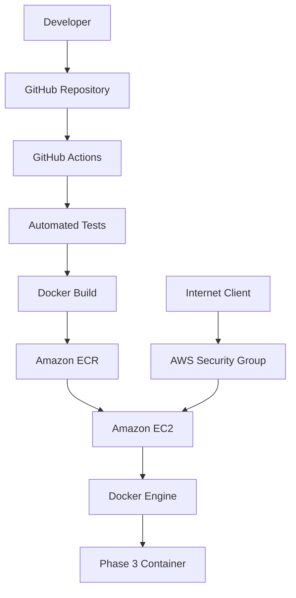

# 🐳 Phase 3 — Advanced: Production-Oriented Docker Container

> An advanced Docker implementation combining Alpine Linux, multi-stage builds, non-root execution, Docker health checks, reduced runtime contents, automated testing, and AWS deployment readiness.

## 📌 Overview

Phase 3 represents the production-oriented evolution of the Docker Mastery Project.

It builds on the lessons from Phase 1 and Phase 2 and introduces:

- Alpine Linux
- Multi-stage builds
- Non-root application execution
- Docker `HEALTHCHECK`
- Runtime-only application content
- Reduced container footprint
- Production-oriented environment configuration
- AWS deployment readiness

The goal is to demonstrate that containerization is not only about making an application run — it is also about making the runtime **leaner, safer, testable, and operationally observable**.

---

# 🎯 Learning Objectives

By completing Phase 3, you should understand:

- Alpine-based containers
- Multi-stage production builds
- Build-time vs runtime dependencies
- Non-root Docker users
- Docker health checks
- Container observability basics
- Production-oriented container configuration
- API validation
- Automated testing
- AWS EC2 deployment concepts
- AWS ECR as a container image registry
- CI/CD deployment architecture

---

# 🏗️ Architecture



---

# 🔐 Security Architecture



---

# 📁 Project Structure

```text
phase3-advanced/
│
├── app/
│   └── main.py
│
├── .github/
│   └── workflows/
│
├── Dockerfile
├── .dockerignore
├── requirements.txt
├── requirements-dev.txt
├── test_main.py
└── README.md
```

If AWS deployment documentation is maintained separately, it can be added as:

```text
EC2-SETUP.md
```

---

# 🧰 Technology Stack

- Python 3.12
- FastAPI `0.111.0`
- Uvicorn `0.30.1`
- Pytest
- Docker
- Alpine Linux
- Multi-stage Docker builds
- GitHub Actions
- AWS EC2
- AWS ECR

---

# 📋 Prerequisites

Verify:

```bash
python3 --version
docker --version
git --version
```

Docker test:

```bash
docker run hello-world
```

For AWS deployment you will additionally need:

- AWS account
- EC2 access
- IAM credentials/role with appropriate permissions
- ECR repository
- Security Group configuration

---

# 1️⃣ Set Up the Development Environment

Navigate to Phase 3:

```bash
cd ~/docker-mastery-project/phase3-advanced
```

Create a virtual environment:

```bash
python3 -m venv venv
```

Activate:

```bash
source venv/bin/activate
```

Install runtime dependencies:

```bash
pip install -r requirements.txt
```

Install development dependencies:

```bash
pip install -r requirements-dev.txt
```

---

# 2️⃣ Run Automated Tests

```bash
pytest
```

The tests validate:

- Root endpoint
- Health endpoint
- Application metadata

Expected:

```text
3 passed
```

---

# 3️⃣ Production-Oriented Dockerfile

The Phase 3 Dockerfile uses a builder and runtime stage:

```dockerfile
FROM python:3.12-alpine AS builder

WORKDIR /app

RUN apk add --no-cache gcc musl-dev libffi-dev

COPY requirements.txt .

RUN pip install --no-cache-dir --user -r requirements.txt

FROM python:3.12-alpine

WORKDIR /app

RUN addgroup -S appgroup && adduser -S appuser -G appgroup

COPY --from=builder /root/.local /home/appuser/.local
COPY app/ ./app

ENV PATH=/home/appuser/.local/bin:$PATH \
    PYTHONUNBUFFERED=1

USER appuser

EXPOSE 8000

HEALTHCHECK --interval=30s --timeout=5s --start-period=5s --retries=3 \
    CMD python -c "import urllib.request; urllib.request.urlopen('http://localhost:8000/health')" || exit 1

CMD ["uvicorn", "app.main:app", "--host", "0.0.0.0", "--port", "8000"]
```

---

# 4️⃣ Dockerfile Breakdown

## Builder Stage

```dockerfile
FROM python:3.12-alpine AS builder
```

A lightweight Alpine-based Python environment is used for dependency installation.

Build tools are installed:

```dockerfile
RUN apk add --no-cache gcc musl-dev libffi-dev
```

Dependencies are installed into the user's local Python path:

```dockerfile
RUN pip install --no-cache-dir --user -r requirements.txt
```

---

## Runtime Stage

A fresh Alpine image is created:

```dockerfile
FROM python:3.12-alpine
```

A dedicated application user is created:

```dockerfile
RUN addgroup -S appgroup && adduser -S appuser -G appgroup
```

The installed Python dependencies are copied from the builder:

```dockerfile
COPY --from=builder /root/.local /home/appuser/.local
```

The application source is copied:

```dockerfile
COPY app/ ./app
```

---

# 5️⃣ Non-Root Container Execution

The container explicitly switches away from root:

```dockerfile
USER appuser
```

Verify after starting the container:

```bash
docker exec phase3-app whoami
```

Expected:

```text
appuser
```

### Why this matters

Running an application as a non-root user reduces the potential impact of a container compromise compared with unnecessarily running the application as root.

---

# 6️⃣ Build the Phase 3 Image

```bash
docker build -t docker-mastery:phase3 .
```

Verify:

```bash
docker images
```

Inspect:

```bash
docker image inspect docker-mastery:phase3
```

View layers:

```bash
docker history docker-mastery:phase3
```

---

# 7️⃣ Run the Container

```bash
docker run -d \
  --name phase3-app \
  -p 8000:8000 \
  docker-mastery:phase3
```

Verify:

```bash
docker ps
```

---

# 8️⃣ Docker Health Check

Phase 3 includes a built-in Docker health check.

The health check calls:

```text
GET /health
```

Docker evaluates the result and reports the container health state.

Check it:

```bash
docker inspect phase3-app \
  --format='{{.State.Health.Status}}'
```

Expected:

```text
healthy
```

You can also see health information with:

```bash
docker ps
```

The container should eventually display:

```text
(healthy)
```

---

# 9️⃣ Test the API

## Root

```bash
curl http://localhost:8000/
```

## Health

```bash
curl http://localhost:8000/health
```

## Info

```bash
curl http://localhost:8000/info
```

The endpoints provide a simple operational interface for validating the application.

---

# 🔟 Verify Non-Root User

```bash
docker exec phase3-app whoami
```

Expected:

```text
appuser
```

This is an important security validation to include in a portfolio demonstration.

---

# 1️⃣1️⃣ View Logs

```bash
docker logs phase3-app
```

Follow logs:

```bash
docker logs -f phase3-app
```

---

# 1️⃣2️⃣ Container Lifecycle

Stop:

```bash
docker stop phase3-app
```

Start:

```bash
docker start phase3-app
```

Remove:

```bash
docker stop phase3-app
docker rm phase3-app
```

If rebuilding from scratch:

```bash
docker build --no-cache -t docker-mastery:phase3 .
```

---

# 🧪 Testing Strategy

Run local tests:

```bash
pytest
```

Then validate the actual Docker runtime:

```bash
docker run -d \
  --name phase3-app \
  -p 8000:8000 \
  docker-mastery:phase3
```

Validate:

```bash
curl http://localhost:8000/
curl http://localhost:8000/health
curl http://localhost:8000/info
```

Validate health:

```bash
docker inspect phase3-app \
  --format='{{.State.Health.Status}}'
```

Validate user:

```bash
docker exec phase3-app whoami
```

This provides two levels of validation:

```text
Automated Tests
      +
Container Runtime Tests
```

---

# 📊 Docker Evolution

| Feature | Phase 1 | Phase 2 | Phase 3 |
|---|---|---|---|
| Base | Ubuntu 22.04 | Python Slim | Python Alpine |
| Build | Single-stage | Multi-stage | Multi-stage |
| Runtime separation | ❌ | ✅ | ✅ |
| Non-root user | ❌ | ❌ | ✅ |
| Health check | ❌ | ❌ | ✅ |
| `.dockerignore` | ✅ | ✅ | ✅ |
| Automated tests | ✅ | ✅ | ✅ |
| CI/CD foundation | — | ✅ | ✅ |
| Production orientation | Basic | Improved | Advanced |

---

# 📉 Image Size Comparison

The project provides a practical comparison of the Docker implementations.

Approximate Docker CLI disk usage observed during development:

| Phase | Strategy | Approx. Size |
|---|---|---:|
| Phase 1 | Ubuntu + single-stage | ~266 MB |
| Phase 2 | Python Slim + multi-stage | ~272 MB |
| Phase 3 | Python Alpine + multi-stage | ~168 MB |

Exact image size can be inspected using:

```bash
docker image inspect docker-mastery:phase3 \
  --format='{{.Size}}'
```

### Important

Docker's displayed disk usage and the image's raw byte size are not always the same. Shared layers and local Docker storage affect displayed disk usage.

The objective is therefore not simply:

> "Make the image smaller."

It is:

> **Build a leaner, safer, reproducible runtime image with only the components needed to run the application.**

---

# 🔄 CI/CD Pipeline

The intended advanced workflow is:



The pipeline can evolve from CI-only validation into full continuous deployment.

---

# ☁️ AWS Deployment Architecture

The recommended portfolio architecture is:



## Deployment sequence

```text
1. Developer pushes code
2. GitHub Actions runs tests
3. Docker image is built
4. Image is pushed to Amazon ECR
5. EC2 authenticates to ECR
6. EC2 pulls the image
7. Docker starts the container
8. Client accesses the FastAPI service
```

---

# 🔐 AWS Security Considerations

For a portfolio deployment:

- Do not commit AWS access keys
- Do not commit GitHub tokens
- Do not commit `.env` files containing secrets
- Use IAM roles where appropriate
- Restrict EC2 Security Group ports
- Expose only required network ports
- Use least-privilege IAM permissions
- Prefer ECR over manually distributing image files
- Keep secrets in an appropriate secrets-management mechanism

---

# 🖼️ Recommended Presentation Images

Create:

```text
images/
├── phase3-dockerfile.png
├── phase3-build.png
├── phase3-image-size.png
├── phase3-container-healthy.png
├── phase3-api-endpoints.png
├── phase3-non-root.png
├── phase3-docker-inspect.png
├── github-actions.png
├── aws-ecr.png
└── aws-ec2.png
```

## Screenshot 1 — Image

```bash
docker images
```

## Screenshot 2 — Running container

```bash
docker ps
```

## Screenshot 3 — Health

```bash
docker inspect phase3-app \
  --format='{{.State.Health.Status}}'
```

Expected:

```text
healthy
```

## Screenshot 4 — Non-root

```bash
docker exec phase3-app whoami
```

Expected:

```text
appuser
```

## Screenshot 5 — API

```bash
curl http://localhost:8000/
curl http://localhost:8000/health
curl http://localhost:8000/info
```

## Screenshot 6 — Tests

```bash
pytest
```

## Screenshot 7 — GitHub Actions

Capture a successful workflow run showing test/build stages.

## Screenshot 8 — AWS

After deployment, capture:

- ECR repository
- EC2 instance
- running Docker container
- application endpoint response

> Avoid screenshots containing AWS access keys, secret keys, GitHub tokens, passwords, or other credentials.

---

# 🛡️ `.dockerignore`

The Phase 3 build context should exclude development and repository files that are not required at runtime.

Typical exclusions:

```text
__pycache__/
*.pyc
*.pyo
.git
.gitignore
.github
venv/
.env
.pytest_cache/
README.md
test_main.py
requirements-dev.txt
```

This keeps unnecessary files out of the Docker build context.

---

# 🧠 What Phase 3 Demonstrates

### Container optimization

```text
Ubuntu
   ↓
Python Slim
   ↓
Python Alpine
```

### Build optimization

```text
Single Stage
     ↓
Multi Stage
```

### Security improvement

```text
Default root
     ↓
Dedicated appuser
```

### Operational improvement

```text
No health signal
     ↓
Docker HEALTHCHECK
```

### Delivery improvement

```text
Manual build
     ↓
Automated test/build
     ↓
Cloud deployment
```

---

# 🏆 Portfolio Highlights

This phase demonstrates several practical DevOps concepts in one project:

- Production-oriented Dockerfile design
- Multi-stage builds
- Alpine Linux
- Dependency isolation
- Non-root container execution
- Health checks
- Automated testing
- CI/CD readiness
- Docker image inspection
- AWS deployment architecture
- Container registry workflow

---

# 🔮 Future Improvements

Possible extensions include:

- Amazon ECR automated publishing
- EC2 automated deployment
- GitHub Actions CD
- Terraform infrastructure
- AWS IAM role-based deployment
- CloudWatch logging
- Trivy vulnerability scanning
- Docker image signing
- Nginx reverse proxy
- HTTPS/TLS
- Docker Compose
- Kubernetes deployment
- Amazon ECS / EKS deployment
- Environment-specific configuration
- Secrets Manager integration

---

# 🧹 Useful Commands

```bash
# Build
docker build -t docker-mastery:phase3 .

# Run
docker run -d --name phase3-app -p 8000:8000 docker-mastery:phase3

# Containers
docker ps
docker ps -a

# Logs
docker logs phase3-app

# Health
docker inspect phase3-app --format='{{.State.Health.Status}}'

# User
docker exec phase3-app whoami

# API
curl http://localhost:8000/
curl http://localhost:8000/health
curl http://localhost:8000/info

# Stop
docker stop phase3-app

# Remove
docker rm phase3-app

# Image
docker images
docker image inspect docker-mastery:phase3
docker history docker-mastery:phase3
```

---

# 📚 Related Documentation

From this directory:

```text
../phase1-beginner/README.md
../phase2-intermediate/README.md
```

For AWS-specific deployment documentation, maintain a separate:

```text
EC2-SETUP.md
```

---

# 👨‍💻 Author

**Srinivas Polamuri**

Docker and DevOps portfolio project demonstrating progressive containerization, optimization, security, testing, CI/CD, and cloud deployment concepts.

---

## ⭐ Project Status

| Phase | Status |
|---|---|
| Phase 1 — Beginner | ✅ Completed |
| Phase 2 — Intermediate | ✅ Completed |
| Phase 3 — Advanced | ✅ Completed |
| GitHub Repository | 🚧 Portfolio setup |
| CI/CD | 🚧 Expanding |
| AWS ECR | 🔜 Planned |
| AWS EC2 | 🔜 Planned |

---

## 📄 License

This project is intended for educational and portfolio purposes. Add an open-source license if you plan to distribute or reuse the project publicly.
